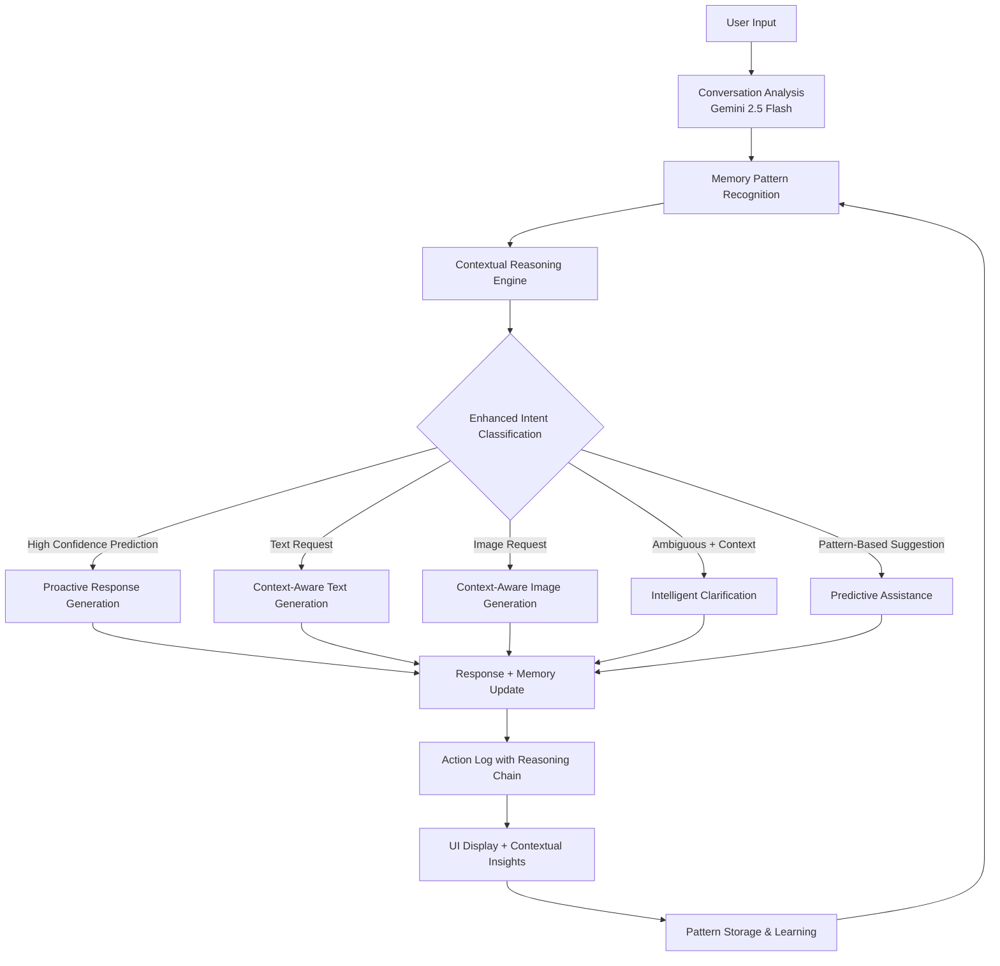

# Awen AI Creative Assistant - Architecture Proposal

## Overview

This document outlines the architecture for a lightweight creative assistant that intelligently routes between text and image generation using Google's Gemini models. The system builds upon the existing T3 stack infrastructure while adding sophisticated AI orchestration capabilities.

## Current State Analysis

### Existing Infrastructure
- **Framework**: Next.js 15 with TypeScript
- **Backend**: tRPC for type-safe APIs
- **Database**: Prisma with SQLite
- **Authentication**: NextAuth with Discord
- **UI**: Tailwind CSS with React
- **State Management**: React hooks with localStorage persistence

### Current Features
- ✅ Conversation session management
- ✅ Message history with timestamps
- ✅ Image gallery functionality
- ✅ Mock AI responses (text/image)
- ✅ Responsive UI with sidebar navigation

## Proposed Architecture

### 1. AI Orchestration Layer

#### Core Components

**Contextual Memory & Reasoning Engine** (`src/services/memory/`):
```typescript
interface ConversationPattern {
  id: string;
  type: 'preference' | 'communication_style' | 'domain_interest' | 'intent_sequence';
  pattern: string;
  confidence: number;
  occurrences: number;
  lastSeen: Date;
  examples: string[];
}

interface ContextualReasoning {
  userIntent: string;
  confidence: number;
  reasoning: string;
  basedOn: ConversationPattern[];
  hypotheticalNext: string[];
  conversationFlow: 'continuation' | 'topic_shift' | 'clarification_needed';
}

interface MemoryInsight {
  userPreferences: Record<string, number>;
  communicationStyle: 'direct' | 'casual' | 'detailed' | 'creative';
  topicInterests: string[];
  intentPatterns: Array<{sequence: string[], frequency: number}>;
  sessionContext: string;
}
```

**Enhanced Agent Decision Engine** (`src/services/agent/`):
```typescript
interface AgentDecision {
  action: 'text' | 'image' | 'clarify' | 'contextual_reasoning';
  confidence: number;
  reasoning: string;
  contextualInsights?: MemoryInsight;
  conversationFlow?: 'continuation' | 'topic_shift' | 'clarification_needed';
  predictedUserNeeds?: string[];
  parameters?: Record<string, unknown>;
}

interface ActionLog {
  timestamp: Date;
  action: string;
  input: string;
  output: string;
  modelUsed: 'gemini-2.5-flash' | 'gemini-2.5-flash-lite';
  confidence: number;
  processingTime: number;
  
  // Enhanced logging
  contextualReasoning?: ContextualReasoning;
  memoryInsights?: MemoryInsight;
  conversationPatterns?: ConversationPattern[];
  reasoningChain?: string[];
}
```

**Model Manager** (`src/services/models/`):
- **Gemini 2.5 Flash**: Primary model for complex reasoning, classification, and high-quality text generation
- **Gemini 2.5 Flash Lite**: Secondary model for simple responses, confirmations, and clarification requests

#### Enhanced Decision Flow with Contextual Memory


### 2. Enhanced Data Models

#### Extended Message Types
```typescript
interface Message {
  id: string;
  type: "user" | "assistant";
  content: string;
  timestamp: Date;
  isImage?: boolean;
  
  // New fields
  intent?: 'text' | 'image' | 'clarify' | 'unknown';
  confidence?: number;
  modelUsed?: string;
  processingTime?: number;
  actionLog?: ActionLog;
  clarificationContext?: string;
}
```

#### Action Logging
```typescript
interface ConversationSession {
  // Existing fields...
  
  // New fields
  actionHistory: ActionLog[];
  totalTokensUsed: number;
  averageResponseTime: number;
  modelUsageStats: Record<string, number>;
}
```

### 3. Service Architecture

#### Enhanced Service Architecture
```
src/services/
├── memory/
│   ├── conversationMemory.ts    # Core memory management
│   ├── patternRecognition.ts    # Pattern detection & analysis
│   ├── contextualReasoning.ts   # Reasoning engine
│   ├── memoryStorage.ts         # Persistent memory storage
│   └── insightGenerator.ts     # User insight generation
├── agent/
│   ├── enhancedDecisionEngine.ts # Memory-aware orchestration
│   ├── intentClassifier.ts      # Context-aware intent analysis
│   ├── proactiveAssistant.ts    # Predictive assistance
│   ├── clarificationHandler.ts  # Smart clarification
│   └── types.ts
├── models/
│   ├── geminiClient.ts          # Gemini API integration
│   ├── contextAwareSelector.ts  # Memory-informed model selection
│   └── rateLimiter.ts           # API rate limiting
├── generation/
│   ├── contextualTextGen.ts     # Context-aware text generation
│   ├── contextualImageGen.ts    # Context-aware image generation
│   └── responsePersonalizer.ts  # Style-adapted responses
└── logging/
    ├── enhancedActionLogger.ts  # Memory-aware action logging
    ├── reasoningTracker.ts      # Reasoning chain logging
    └── conversationAnalytics.ts # Pattern & insight analytics
```

#### Enhanced tRPC API Routes
```typescript
// src/server/api/routers/ai.ts
export const aiRouter = createTRPCRouter({
  processMessage: publicProcedure
    .input(z.object({
      content: z.string(),
      sessionId: z.string(),
      conversationHistory: z.array(messageSchema).optional(),
      userMemoryFingerprint: z.string().optional()
    }))
    .mutation(async ({ input }) => {
      // Enhanced orchestration with memory and reasoning
      const memory = await memoryService.getConversationMemory(input.sessionId);
      const patterns = await patternService.analyzePatterns(input.conversationHistory);
      const contextualReasoning = await reasoningEngine.reasonAboutIntent(
        input.content, 
        input.conversationHistory, 
        patterns
      );
      // ... rest of logic
    }),
    
  getMemoryInsights: publicProcedure
    .input(z.object({ sessionId: z.string() }))
    .query(async ({ input }) => {
      // Return memory insights and patterns for session
      return await memoryService.getInsights(input.sessionId);
    }),
    
  getConversationPatterns: publicProcedure
    .input(z.object({ sessionId: z.string() }))
    .query(async ({ input }) => {
      // Return detected conversation patterns
      return await patternService.getPatterns(input.sessionId);
    }),
    
  getReasoningChain: publicProcedure
    .input(z.object({ messageId: z.string() }))
    .query(async ({ input }) => {
      // Return reasoning chain for specific response
      return await reasoningService.getReasoningChain(input.messageId);
    }),
    
  getPredictiveInsights: publicProcedure
    .input(z.object({ sessionId: z.string() }))
    .query(async ({ input }) => {
      // Return predictions for likely next user actions
      return await reasoningEngine.generatePredictiveInsights(input.sessionId);
    }),
    
  updateUserFeedback: publicProcedure
    .input(z.object({
      messageId: z.string(),
      helpful: z.boolean(),
      feedbackType: z.enum(['response_quality', 'prediction_accuracy', 'style_preference'])
    }))
    .mutation(async ({ input }) => {
      // Update memory patterns based on user feedback
      await memoryService.updateFromFeedback(input);
    })
});
```

### 4. Contextual Memory & Reasoning System

#### Memory Components

**Conversation Pattern Recognition**:
```typescript
class PatternRecognitionEngine {
  async analyzeConversation(messages: Message[]): Promise<ConversationPattern[]> {
    // Detect recurring themes, preferences, communication styles
    // Identify intent sequences and user behavior patterns
    // Extract domain interests and knowledge areas
  }
  
  async updatePatterns(newMessage: Message, response: Message): Promise<void> {
    // Continuously learn from user interactions
    // Reinforce successful patterns, adjust failed ones
  }
}
```

**Contextual Reasoning Engine**:
```typescript
class ContextualReasoningEngine {
  async reasonAboutIntent(
    input: string, 
    conversationHistory: Message[], 
    patterns: ConversationPattern[]
  ): Promise<ContextualReasoning> {
    // Hypothesize user intent based on conversation flow
    // Predict likely next user needs
    // Assess conversation continuation vs topic shift
    // Generate proactive assistance suggestions
  }
  
  async generatePredictiveInsights(
    patterns: ConversationPattern[]
  ): Promise<string[]> {
    // Predict what user might ask next
    // Suggest relevant topics or assistance
    // Anticipate workflow continuations
  }
}
```

#### Memory-Driven Intelligence Features

1. **Proactive Assistance**: 
   - "Based on our previous conversations about design, would you like me to generate some visual concepts for this project?"
   - "I notice you often ask for code explanations - should I include implementation details?"

2. **Contextual Clarification**:
   - Instead of generic "Could you be more specific?"
   - "Are you looking for another product mockup like we created last week, or something different?"

3. **Style Adaptation**:
   - Learn user's preferred response length, technical level, formality
   - Adapt communication style based on conversation patterns

4. **Workflow Continuity**:
   - Remember ongoing projects and offer to continue where left off
   - Suggest logical next steps based on conversation sequence patterns

#### Memory Storage & Persistence

```typescript
interface ConversationMemory {
  userId?: string; // If authenticated
  sessionFingerprint: string; // For anonymous users
  patterns: ConversationPattern[];
  insights: MemoryInsight;
  conversationGraph: {
    topics: string[];
    transitions: Array<{from: string, to: string, frequency: number}>;
    preferences: Record<string, number>;
  };
  lastUpdated: Date;
  memoryVersion: number;
}
```

### 5. Enhanced Intent Classification System

#### Classification Categories
1. **Text Generation**:
   - Questions, conversations, explanations
   - Creative writing requests
   - Code generation, analysis
   - General information requests

2. **Image Generation**:
   - Explicit image requests ("create an image", "generate a picture")
   - Visual descriptions ("show me", "visualize")
   - Art/design requests

3. **Ambiguous/Clarification Needed**:
   - Vague requests
   - Missing context
   - Multiple possible interpretations

#### Smart Model Selection
```typescript
function selectModel(intent: string, complexity: number, conversationHistory: Message[]): 'gemini-2.5-flash' | 'gemini-2.5-flash-lite' {
  if (intent === 'image' || complexity > 0.7) {
    return 'gemini-2.5-flash';
  }
  
  if (intent === 'clarify' || complexity < 0.3) {
    return 'gemini-2.5-flash-lite';
  }
  
  // Consider conversation context for dynamic selection
  return 'gemini-2.5-flash';
}
```

### 6. Enhanced UI with Memory Visualization

#### Memory-Aware Action Log Display
```typescript
interface EnhancedActionLogDisplay {
  timestamp: string;
  action: 'Contextual Analysis' | 'Pattern Recognition' | 'Reasoning' | 'Text Generation' | 'Image Generation' | 'Proactive Suggestion';
  model: string;
  input: string;
  output: string;
  confidence: number;
  duration: string;
  
  // Memory enhancements
  reasoningChain: string[];
  memoryInsights: {
    patternsUsed: string[];
    conversationFlow: string;
    predictions: string[];
    userStyle: string;
  };
  contextualFactors: string[];
}
```

#### Advanced UI Components

**Memory Insight Panel**:
```typescript
interface MemoryInsightPanel {
  userPreferences: Array<{preference: string, confidence: number}>;
  communicationStyle: string;
  topicInterests: string[];
  conversationFlow: 'continuation' | 'topic_shift' | 'new_direction';
  predictedNeeds: string[];
  patternHistory: ConversationPattern[];
}
```

**Reasoning Chain Visualization**:
- **Step-by-step reasoning**: Show how AI arrived at its decision
- **Memory influence indicators**: Highlight which patterns influenced the response
- **Confidence evolution**: Show how confidence changes through reasoning steps
- **Alternative paths**: Display other options AI considered

**Proactive Assistance UI**:
- **Predictive suggestions**: "You might want to..." based on patterns
- **Workflow continuations**: "Should we continue with..." suggestions
- **Context-aware clarifications**: Smart follow-up questions
- **Style adaptation indicators**: Show when AI adapts to user preferences

**Enhanced Message UI Features**:
- **Memory Context Badge**: Shows when response uses conversation memory
- **Pattern Recognition Indicator**: Highlights detected user patterns
- **Reasoning Transparency**: Expandable reasoning chain for each response
- **Predictive Insights Sidebar**: Shows AI's predictions for next user actions
- **Conversation Flow Tracker**: Visual representation of topic transitions
- **User Style Adaptation**: Shows how AI adapts to communication preferences

### 6. Environment Configuration

#### Updated env.js
```typescript
server: {
  // Existing vars...
  GEMINI_API_KEY: z.string(),
  GEMINI_PROJECT_ID: z.string().optional(),
  AI_MAX_TOKENS: z.number().default(1000),
  AI_TEMPERATURE: z.number().default(0.7),
}
```

## Enhanced Implementation Strategy

### Phase 1: Memory Foundation (Week 1-2)
1. ✅ Environment setup with Gemini API key
2. **Memory Infrastructure**:
   - Create conversation memory data models
   - Implement basic pattern recognition service
   - Build memory storage with localStorage/IndexedDB
   - Add user fingerprinting for anonymous users

3. **Basic Gemini Integration**:
   - Gemini client with context-aware prompting
   - Basic intent classification with conversation history
   - Simple pattern detection algorithms

### Phase 2: Contextual Reasoning Engine (Week 3-4)
1. **Reasoning Engine Core**:
   - Implement contextual reasoning service
   - Build conversation flow analysis
   - Create pattern-based prediction system
   - Add hypothetical intent generation

2. **Enhanced Decision Engine**:
   - Memory-aware intent classification
   - Context-informed model selection
   - Proactive assistance logic
   - Intelligent clarification system

### Phase 3: Advanced Memory Features (Week 5-6)
1. **Pattern Recognition Enhancement**:
   - User preference learning
   - Communication style adaptation
   - Topic interest tracking
   - Intent sequence pattern detection

2. **Predictive Intelligence**:
   - Workflow continuation suggestions
   - Proactive assistance recommendations
   - Context-aware response personalization
   - Smart clarification with memory context

### Phase 4: UI & Visualization (Week 7-8)
1. **Memory-Aware UI Components**:
   - Reasoning chain visualization
   - Memory insight panels
   - Pattern recognition indicators
   - Predictive suggestions UI

2. **Enhanced Action Logging**:
   - Multi-step reasoning display
   - Memory influence visualization
   - Conversation flow tracking
   - User feedback integration

### Phase 5: Intelligence Optimization (Week 9-10)
1. **Learning & Adaptation**:
   - Continuous pattern refinement
   - User feedback incorporation
   - Memory pruning and optimization
   - Performance analytics

2. **Advanced Features**:
   - Cross-session memory (with consent)
   - Conversation topic modeling
   - Behavioral pattern clustering
   - Predictive accuracy metrics

### Phase 6: Polish & Performance (Week 11-12)
1. **System Optimization**:
   - Memory storage optimization
   - API rate limiting with intelligent caching
   - Response time optimization
   - Memory usage management

2. **Production Readiness**:
   - Comprehensive error handling
   - Privacy controls for memory data
   - Analytics and monitoring
   - Performance testing at scale

## Framework Decision: No Additional Orchestration Framework Needed

### Recommendation: Leverage Existing T3 Stack

**Why no additional framework is needed:**

1. **tRPC Provides Type-Safe Orchestration**: The existing tRPC setup already provides excellent type safety and API structure for orchestrating AI calls.

2. **React/Next.js Handles State Management**: The current hook-based architecture with localStorage persistence is sufficient for conversation management.

3. **Service Layer Pattern**: A simple service layer architecture will provide clean separation of concerns without framework overhead.

4. **Simplicity & Maintainability**: Adding frameworks like LangChain or custom orchestration frameworks would introduce unnecessary complexity for this use case.

**Alternative Considerations:**
- **LangChain**: Overkill for this simple routing use case, adds significant bundle size
- **Custom State Machine**: Unnecessary given the simple decision tree
- **Workflow Engines**: Too heavy for real-time conversational AI

### Recommended Service Architecture Pattern

```typescript
// Clean service layer without framework dependencies
class AIChatOrchestrator {
  constructor(
    private geminiClient: GeminiClient,
    private intentClassifier: IntentClassifier,
    private actionLogger: ActionLogger
  ) {}

  async processMessage(input: string, context: ConversationContext): Promise<AIResponse> {
    const intent = await this.intentClassifier.classify(input, context);
    const model = this.selectModel(intent);
    const response = await this.generateResponse(intent, input, model);
    
    await this.actionLogger.log({
      action: intent.action,
      model,
      input,
      output: response.content,
      confidence: intent.confidence
    });
    
    return response;
  }
}
```

## Example User Experience Scenarios

### Scenario 1: Intelligent Workflow Continuation
```
User: "I'm working on a logo design"
AI: [Analyzes: New topic, likely needs visual assistance]
    "I'd be happy to help with your logo design! Should I generate some visual concepts for you?"

User: "Yes, something modern and minimalist"
AI: [Memory: User prefers modern/minimalist style - stores pattern]
    [Generates logo concepts]

[Later in conversation]
User: "Now I need a business card"
AI: [Memory: Previous design preference = modern/minimalist]
    [Reasoning: Likely wants consistent brand design]
    "Based on your minimalist logo style, should I create a business card design that matches that aesthetic?"
```

### Scenario 2: Context-Aware Clarification
```
User: "Make it bigger"
AI: [Memory: Last response was a product mockup image]
    [Reasoning: "it" likely refers to previous image]
    "Should I resize the product mockup I just created, or are you referring to a specific element within it?"

vs. Generic AI:
"Could you be more specific about what you'd like me to make bigger?"
```

### Scenario 3: Proactive Assistance
```
User: "I'm building a React component"
AI: [Memory: User previously asked for TypeScript explanations]
    [Pattern: User appreciates implementation details]
    [Reasoning: Likely wants complete, well-explained code]
    "I'll create a React component for you. Based on our previous conversations, should I include TypeScript types and detailed comments explaining the implementation?"
```

## Enhanced Success Metrics

### Intelligence Metrics
1. **Contextual Accuracy**: >85% correct predictions based on conversation history
2. **Proactive Relevance**: >75% of proactive suggestions rated as helpful
3. **Pattern Recognition**: Successfully identify user preferences within 3-5 interactions
4. **Memory Utilization**: 60%+ of responses incorporate relevant conversation memory

### User Experience Metrics
5. **Clarification Reduction**: 40% fewer generic clarification requests
6. **Workflow Continuity**: 70% of multi-step tasks completed without re-explanation
7. **Style Adaptation**: Users notice and appreciate personalized communication style
8. **Predictive Satisfaction**: 80% accuracy in predicting user's next likely needs

### Technical Performance
9. **Response Time**: <3s average response time (including memory processing)
10. **Memory Efficiency**: <50MB memory storage per user after 100 interactions
11. **Cost Optimization**: Smart model selection reduces API costs by 35%
12. **Reasoning Transparency**: Complete reasoning chains logged for all decisions

## The "Contextual Reasoning" Action

The new **contextual_reasoning** action represents the core intelligence enhancement that makes the assistant feel truly intelligent. This action is triggered when:

1. **Memory Analysis Required**: When conversation history suggests specific user patterns
2. **Proactive Assistance Opportunity**: When patterns indicate likely next user needs  
3. **Context-Dependent Clarification**: When ambiguous input can be resolved using memory
4. **Workflow Continuation**: When previous conversation suggests logical next steps

### Action Execution Flow
```typescript
async function executeContextualReasoning(
  input: string,
  conversationHistory: Message[],
  patterns: ConversationPattern[]
): Promise<ContextualReasoningResult> {

  // 1. Analyze conversation context
  const contextAnalysis = await analyzeConversationContext(conversationHistory);
  
  // 2. Apply pattern recognition
  const relevantPatterns = await identifyRelevantPatterns(input, patterns);
  
  // 3. Generate hypothetical intents
  const hypotheticalIntents = await generateHypotheticalIntents(
    input, 
    contextAnalysis, 
    relevantPatterns
  );
  
  // 4. Reason about user needs
  const predictedNeeds = await predictUserNeeds(
    hypotheticalIntents, 
    conversationHistory
  );
  
  // 5. Generate contextually-aware response
  const response = await generateContextualResponse(
    input,
    predictedNeeds,
    relevantPatterns
  );
  
  return {
    response,
    reasoningChain: [
      "Analyzed conversation context",
      `Applied ${relevantPatterns.length} relevant patterns`,
      `Generated ${hypotheticalIntents.length} hypothetical intents`,
      "Predicted user needs based on patterns",
      "Generated contextually-aware response"
    ],
    confidence: calculateContextualConfidence(relevantPatterns, contextAnalysis),
    memoryInfluence: relevantPatterns,
    predictions: predictedNeeds
  };
}
```

This action type creates the "thinking" layer that makes users feel like the AI truly understands them and can anticipate their needs based on previous interactions.

## Risk Mitigation

1. **API Rate Limits**: Implement exponential backoff and request queuing
2. **Model Failures**: Graceful fallbacks between models
3. **Cost Control**: Token usage monitoring and limits
4. **Data Privacy**: Local storage for sensitive conversation data
5. **Error Handling**: Comprehensive error boundaries and user feedback

## Conclusion

This enhanced architecture transforms your creative assistant into an intelligent, memory-aware system that learns and adapts to users over time. By adding the contextual reasoning layer, the AI moves beyond simple request-response patterns to exhibit genuine understanding and anticipation of user needs.

**Key Intelligence Features:**
- **Conversational Memory**: Remembers user preferences, communication styles, and project contexts
- **Pattern Recognition**: Learns from interaction patterns to predict user needs
- **Contextual Reasoning**: Makes intelligent decisions based on conversation history and user patterns
- **Proactive Assistance**: Anticipates user needs and offers relevant suggestions
- **Transparent Intelligence**: Shows complete reasoning chains so users understand AI decision-making

**Technical Advantages:**
- **No Framework Overhead**: Leverages existing T3 stack without additional orchestration complexity
- **Scalable Memory System**: Efficient pattern storage and retrieval using existing infrastructure
- **Cost-Effective**: Smart model selection based on context reduces API costs
- **Privacy-Conscious**: Local memory storage with user control over data retention

The result is a creative assistant that feels genuinely intelligent - one that learns your preferences, anticipates your needs, and provides contextually relevant assistance that improves over time. Users will experience the difference immediately through reduced clarification requests, more relevant suggestions, and seamless workflow continuations.

This architecture positions Awen as a next-generation AI assistant that doesn't just respond to requests, but actively collaborates with users by understanding their goals, remembering their preferences, and predicting their needs.